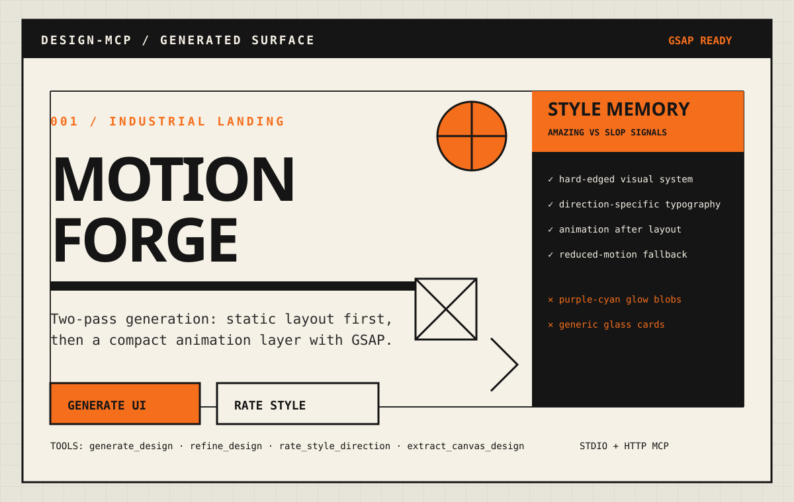

<p align="center">
  
</p>

<h1 align="center">design-mcp</h1>

<p align="center">
  Local MCP server for generating opinionated UI designs, adding animation passes, and teaching taste memory what is <strong>amazing</strong> vs <strong>slop</strong>.
</p>

<p align="center">
  <a href="https://github.com/fauzanazz/design-mcp"></a>
  
  
</p>

---

## Why design-mcp?

Most design generators overfit to the same AI SaaS look: purple/cyan gradients, soft glow blobs, glass cards, Inter, and vague centered hero sections.

design-mcp adds a local MCP workflow that:

- Generates single-file HTML/CSS product surfaces from a prompt and repo context.
- Optionally runs a second `animate_after_layout` pass after the layout is stable.
- Allows compact GSAP/JavaScript only in the animation layer.
- Stores style memory with `rate_style_direction`, so users can label outputs as `amazing` or `slop`.
- Feeds that taste memory back into future generations.

## Example prompt

```txt
Generate a compact one-screen landing page for MotionForge with a hero headline,
subtitle, CTA, and a polished GSAP entrance timeline.
```

With `animate_after_layout: true`, the flow is:

```txt
layout pass -> animation-only refine pass -> review prompt -> user rates style memory
```

## Demo gallery

Open `assets/demo/index.html` in a browser to view short, GitHub-friendly examples generated for different product surfaces:

- `assets/demo/signalforge-landing.html` — technical product landing page.
- `assets/demo/northstar-ops-dashboard.html` — executive operations dashboard.
- `assets/demo/arcade-kinetic-hero.html` — expressive kinetic hero page.

## Installation

```bash
git clone https://github.com/fauzanazz/design-mcp.git
cd design-mcp
bun install
```

## MCP setup

### Droid / Claude Code stdio

Add this to your MCP config:

```json
{
  "mcpServers": {
    "design-mcp": {
      "command": "bun",
      "args": ["/absolute/path/to/design-mcp/src/stdio.ts"],
      "env": {
        "DESIGN_MCP_USE_ENGINE": "1",
        "DESIGN_MCP_ENGINE_PROVIDER": "claude-binary",
        "DESIGN_MCP_WRITE_ARTIFACTS": "1",
        "DESIGN_MCP_ARTIFACT_BASE_PATH": "/absolute/path/to/design-mcp",
        "DESIGN_MCP_MODEL": "claude-sonnet-4-6",
        "DESIGN_MCP_ANIMATION_MODEL": "haiku",
        "DESIGN_MCP_REFINE_TOKENS": "1",
        "DESIGN_MCP_DB_PATH": "/absolute/path/to/design-mcp/data/design-mcp.db"
      }
    }
  }
}
```

Then restart your MCP client.

### Install into another repo

From any machine where this repo is cloned and `bun` is installed, run this from the target project:

```bash
DESIGN_MCP_ROOT="/absolute/path/to/design-mcp"
STDIO="$DESIGN_MCP_ROOT/src/stdio.ts"
DB="$DESIGN_MCP_ROOT/data/design-mcp.db"

test -f "$STDIO" || { echo "Missing $STDIO"; exit 1; }

# Claude Code: project-scoped server in the current repo.
claude mcp add -s project \
  -e DESIGN_MCP_USE_ENGINE=1 \
  -e DESIGN_MCP_ENGINE_PROVIDER=claude-binary \
  -e DESIGN_MCP_WRITE_ARTIFACTS=1 \
  -e DESIGN_MCP_ARTIFACT_BASE_PATH="$DESIGN_MCP_ROOT" \
  -e DESIGN_MCP_MODEL=claude-sonnet-4-6 \
  -e DESIGN_MCP_ANIMATION_MODEL=haiku \
  -e DESIGN_MCP_REFINE_TOKENS=1 \
  -e DESIGN_MCP_DB_PATH="$DB" \
  design-mcp -- bun "$STDIO"

# Codex: stdio server registration.
codex mcp add design-mcp \
  --env DESIGN_MCP_USE_ENGINE=1 \
  --env DESIGN_MCP_ENGINE_PROVIDER=claude-binary \
  --env DESIGN_MCP_WRITE_ARTIFACTS=1 \
  --env DESIGN_MCP_ARTIFACT_BASE_PATH="$DESIGN_MCP_ROOT" \
  --env DESIGN_MCP_MODEL=claude-sonnet-4-6 \
  --env DESIGN_MCP_ANIMATION_MODEL=haiku \
  --env DESIGN_MCP_REFINE_TOKENS=1 \
  --env DESIGN_MCP_DB_PATH="$DB" \
  -- bun "$STDIO"
```

Or use this one-shot installer:

```bash
DESIGN_MCP_ROOT="/absolute/path/to/design-mcp" bash <<'SH'
set -euo pipefail

: "${DESIGN_MCP_ROOT:?Set DESIGN_MCP_ROOT to the design-mcp repo path}"

STDIO="$DESIGN_MCP_ROOT/src/stdio.ts"
DB="$DESIGN_MCP_ROOT/data/design-mcp.db"

test -f "$STDIO" || { echo "Missing $STDIO"; exit 1; }

claude mcp remove design-mcp >/dev/null 2>&1 || true
codex mcp remove design-mcp >/dev/null 2>&1 || true

claude mcp add -s project \
  -e DESIGN_MCP_USE_ENGINE=1 \
  -e DESIGN_MCP_ENGINE_PROVIDER=claude-binary \
  -e DESIGN_MCP_WRITE_ARTIFACTS=1 \
  -e DESIGN_MCP_ARTIFACT_BASE_PATH="$DESIGN_MCP_ROOT" \
  -e DESIGN_MCP_MODEL=claude-sonnet-4-6 \
  -e DESIGN_MCP_ANIMATION_MODEL=haiku \
  -e DESIGN_MCP_REFINE_TOKENS=1 \
  -e DESIGN_MCP_DB_PATH="$DB" \
  design-mcp -- bun "$STDIO"

codex mcp add design-mcp \
  --env DESIGN_MCP_USE_ENGINE=1 \
  --env DESIGN_MCP_ENGINE_PROVIDER=claude-binary \
  --env DESIGN_MCP_WRITE_ARTIFACTS=1 \
  --env DESIGN_MCP_ARTIFACT_BASE_PATH="$DESIGN_MCP_ROOT" \
  --env DESIGN_MCP_MODEL=claude-sonnet-4-6 \
  --env DESIGN_MCP_ANIMATION_MODEL=haiku \
  --env DESIGN_MCP_REFINE_TOKENS=1 \
  --env DESIGN_MCP_DB_PATH="$DB" \
  -- bun "$STDIO"

echo "Restart Claude Code/Codex, then use the generate_design tool."
SH
```

This uses `claude-binary` because the default `sdk` provider requires `ANTHROPIC_API_KEY`; make sure the `claude` CLI is installed and logged in.

### HTTP MCP

```bash
bun start
```

The HTTP server listens on `:3333` by default and exposes MCP at:

```txt
http://localhost:3333/mcp
```

Inspect it with:

```bash
bun inspect
```

## Available tools

| Tool | Purpose |
| --- | --- |
| `generate_design` | Generate a new UI from prompt + repo context. |
| `refine_design` | Refine a prior run or raw HTML with feedback. |
| `rate_style_direction` | Teach the style database that something is `amazing` or `slop`. |
| `list_canvases` | Stub canvas listing surface. |
| `get_canvas` | Stub canvas detail surface. |
| `extract_canvas_design` | Stub design extraction surface. |
| `create_editor_session` | Stub editor session flow. |
| `link_editor_session` | Stub editor link flow. |
| `unlink_editor_session` | Stub editor unlink flow. |
| `whoami` | Returns stub user info. |
| `get_credit_status` | Returns stub credit info. |

## Usage

### Generate a design

```json
{
  "prompt": "Industrial landing page for a developer animation toolkit",
  "repo_context": "n/a",
  "viewport": "desktop",
  "mode": "none",
  "animate_after_layout": true
}
```

The response includes:

- `run_id`
- `html`
- `summary`
- `review_prompt`
- `animate_after_layout`

### Teach taste memory

After reviewing a generated result, call `rate_style_direction`:

```json
{
  "run_id": "<generated-run-id>",
  "quality": "amazing",
  "aesthetic": "industrial / utilitarian",
  "title": "Machine interface landing",
  "signals": "condensed type, hard borders, signal orange, technical grid",
  "guidance": "Use dense technical hierarchy and schematic marks for developer-tool surfaces.",
  "weight": 8
}
```

For bad outputs, use:

```json
{
  "quality": "slop",
  "aesthetic": "all",
  "title": "Generic AI SaaS blob stack",
  "signals": "purple-cyan gradient, glass cards, glow orbs, vague centered hero",
  "guidance": "Avoid this pattern; replace it with direction-specific structure and ornament.",
  "weight": 10
}
```

## Configuration

| Env | Default | Notes |
| --- | --- | --- |
| `DESIGN_MCP_USE_ENGINE` | `false` | Uses canned responses when off. |
| `DESIGN_MCP_ENGINE_PROVIDER` | `sdk` | Use `claude-binary` for Claude CLI mode. |
| `DESIGN_MCP_MODEL` | `claude-sonnet-4-6` | Main layout generation model. |
| `DESIGN_MCP_ANIMATION_MODEL` | `haiku` | Cheaper/faster animation refine model. |
| `DESIGN_MCP_REFINE_TOKENS` | `false` | Refines slop-class color/font tokens first. |
| `DESIGN_MCP_WRITE_ARTIFACTS` | `false` | Writes `.aidesigner/runs/<run_id>`. |
| `DESIGN_MCP_DB_PATH` | `./data/design-mcp.db` | SQLite store for runs and style memory. |
| `DESIGN_MCP_API_KEY` | empty | Required in production HTTP mode. |

## Development

```bash
cp .env.example .env
bun run typecheck
bun test
```

Run in watch mode:

```bash
bun dev
```

## Smoke tests

```bash
bun test test/m2.engine.test.ts
```

Full local smoke with artifacts:

```bash
DESIGN_MCP_USE_ENGINE=1 \
DESIGN_MCP_ENGINE_PROVIDER=claude-binary \
DESIGN_MCP_WRITE_ARTIFACTS=1 \
bun scripts/smoke-fullstack.ts
```

## Notes

- Default test mode uses canned HTML, so CI does not need model credentials.
- Runtime databases and generated artifacts are ignored by git.
- `animate_after_layout` is intentionally two-pass: better output, higher latency.
